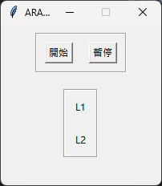
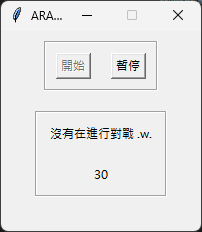
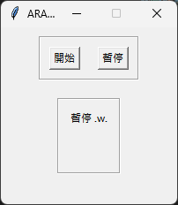

LOL_ARAM 隨機單中小助手
====================

- 在英雄聯盟的隨機單模式中，如果玩家因突發事件需要暫時離開，程式可自動操作角色以防止被判定為中離。
- 倒數計時 15 秒方便送塔，可解成就 (光速回家)

## 介面 / 功能

### aram_easy.py

每隔30秒會攻擊敵方主堡 (需自訂紅/藍方)

### countdown.py

用 ai 配音的 1~15 秒 mp3檔倒數計時 15 秒
按下 "z" 鍵可重新倒數
按下 "esc" 鍵可歸零

### aram_afk.py

按下開始後會爬取 [opgg](https://lol-web-api.op.gg/api/v1.0/internal/bypass/spectates/tw/1nXTkNy9PF9RGpU4P_kFz-49_aze2BUmOXCtJDPOuPsw3_IZY9cRPA2Hlg) 上我的 LOL 帳號查看是否正在進行對戰

按下暫停可暫停程式

## 待改進問題

- 遊戲結束後 opgg 仍然顯示在進行對戰，導致程式一直點擊畫面右下角敵方主堡處

## 待新增功能

- 顯示對戰資訊
- 結合掛機和倒數計時功能
- 通過按下 F1 ~ F5 來讓角色移動看起來不像腳本
- 可以施放技能
- 根據每個角色不同用不同方式施放技能
- 稍微提高勝率
